# GitHub Actions: Zero to Advanced

> Go from *"I've never written a line of YAML"* to *building real, multi-job CI pipelines* with GitHub Actions — all from the browser, no local setup required.

This is the teaching script **and** the self-study guide for the video series (channel **LearnWithMithran**). Every concept below has:

1. **What it is** — a plain-English explanation of the keyword.
2. **A tiny example** — a small, focused YAML file you can copy-paste and run.
3. **What to observe** — what you should see in the **Actions** tab.

Everything is taught against the **current (2026) GitHub Actions platform** — current action versions (`actions/checkout@v5`, `actions/setup-node@v6`), and least-privilege defaults.

---

## 📚 Table of Contents

**Getting started**

- [How to use this course (browser-only)](#how-to-use-this-course-browser-only)

**Day 1 — Foundations**

1. [What is CI/CD and where does GitHub Actions fit?](#1--what-is-cicd-and-where-does-github-actions-fit)
2. [YAML in 10 minutes](#2--yaml-in-10-minutes)
3. [Anatomy of a workflow](#3--anatomy-of-a-workflow)
4. [Triggers — the `on` keyword](#4--triggers--the-on-keyword)
5. [Runners — the `runs-on` keyword](#5--runners--the-runs-on-keyword)
6. [Steps: `run` vs `uses`](#6--steps-run-vs-uses)
7. [Marketplace actions: checkout & setup-node](#7--marketplace-actions-checkout--setup-node)

**Day 2 — From one job to a real pipeline**

8. [Environment variables & scopes](#8--environment-variables--scopes)
9. [Contexts & expressions](#9--contexts--expressions)
10. [Secrets & variables](#10--secrets--variables)
11. [🚀 Your first CI pipeline (capstone)](#11---your-first-ci-pipeline-capstone)
12. [Many jobs run in parallel](#12--many-jobs-run-in-parallel)
13. [`needs` — building a pipeline](#13--needs--building-a-pipeline)
14. [`if` — conditional jobs and steps](#14--if--conditional-jobs-and-steps)
15. [Status functions](#15--status-functions)

**Day 3 — Production pipelines: reuse, security & gated deploys**

16. [Job outputs — passing values between jobs](#16--job-outputs--passing-values-between-jobs)
17. [Matrix builds — one job, many versions](#17--matrix-builds--one-job-many-versions)
18. [Multi-dimension matrices: `include` & `exclude`](#18--multi-dimension-matrices-include--exclude)
19. [Controlling a matrix: `fail-fast` & `max-parallel`](#19--controlling-a-matrix-fail-fast--max-parallel)
20. [Caching dependencies](#20--caching-dependencies)
21. [Artifacts — sharing files between jobs](#21--artifacts--sharing-files-between-jobs)
22. [Matrix artifacts & merging](#22--matrix-artifacts--merging)
23. [Reusable workflows — reuse a whole job](#23--reusable-workflows--reuse-a-whole-job)
24. [Composite actions — reuse a few steps](#24--composite-actions--reuse-a-few-steps)
25. [`GITHUB_TOKEN` & least-privilege `permissions`](#25--github_token--least-privilege-permissions)
26. [Environments & approvals](#26--environments--approvals)
27. [Concurrency — cancel stale runs, serialise deploys](#27--concurrency--cancel-stale-runs-serialise-deploys)
28. [Timeouts & `continue-on-error`](#28--timeouts--continue-on-error)
29. [🚀 The production pipeline (capstone)](#29---the-production-pipeline-capstone)

**Day 4 — Advanced: security, OIDC, custom actions & publishing**

30. [Supply-chain security: pin actions to a SHA](#30--supply-chain-security-pin-actions-to-a-sha)
31. [CodeQL code scanning](#31--codeql-code-scanning)
32. [Secret scanning & push protection](#32--secret-scanning--push-protection)
33. [Untrusted PRs & `pull_request_target`](#33--untrusted-prs--pull_request_target)
34. [OIDC: keyless cloud authentication](#34--oidc-keyless-cloud-authentication)
35. [Self-hosted & scaled runners](#35--self-hosted--scaled-runners)
36. [Chaining workflows: `workflow_run` & `repository_dispatch`](#36--chaining-workflows-workflow_run--repository_dispatch)
37. [Monorepo change detection](#37--monorepo-change-detection)
38. [Build & push a Docker image to GHCR](#38--build--push-a-docker-image-to-ghcr)
39. [Custom JavaScript actions](#39--custom-javascript-actions)
40. [Custom Docker container actions](#40--custom-docker-container-actions)
41. [Publishing & versioning your own action](#41--publishing--versioning-your-own-action)
42. [Debugging & running locally with `act`](#42--debugging--running-locally-with-act)
43. [🚀 The hardened pipeline (capstone)](#43---the-hardened-pipeline-capstone)

**Reference**

- [Cheat sheet](#-cheat-sheet)
- [Reference links](#-reference-links)
- [You've finished the course](#-youve-finished-the-course)

---

## How to use this course (browser-only)

You do **not** need to install anything. We work entirely in the GitHub website.

### One-time setup

1. Sign in to [github.com](https://github.com).
2. Click **New repository** → name it `github-actions-practice` → check **Add a README** → **Create repository**.

### The loop we repeat throughout

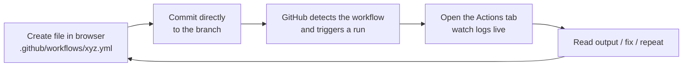

**To add a workflow file in the browser:**

1. Click **Add file → Create new file**.
2. In the filename box, type: `.github/workflows/01-hello-world.yml`
   - ⚠️ The folder path **must** be exactly `.github/workflows/`. GitHub only looks there.
3. Paste the YAML content.
4. Scroll down → **Commit changes** (commit directly to `main` for practice).
5. Click the **Actions** tab to watch it run.

> 💡 **Where the files live in this repo:** the copy-paste YAML files are numbered in teaching order and grouped into folders — files `01`–`11` in [`day-01/workflows/`](day-01/workflows/), `12`–`19` in [`day-02/workflows/`](day-02/workflows/), `20`–`34` in [`day-03/workflows/`](day-03/workflows/), and `35`–`49` in [`day-04/workflows/`](day-04/workflows/) (custom actions live in each day's `actions/` folder). The number is the teaching order — just follow them in sequence. The sample app is in [`sample-app/`](sample-app/) at the repo root.
>
> 📦 **Everything is prebuilt — nothing to generate.** Clone or download this repo and you get every workflow file plus a complete, ready-to-run sample app, `package-lock.json` included. There is no setup step, no `npm install` on your machine, and no lockfile to create. Copy, commit, watch it run.

---

# Day 1 — Foundations

**Goal:** demystify CI/CD, get comfortable with YAML and workflow anatomy, and understand the core keywords — triggers, runners, `run`/`uses`, and Marketplace actions.

## 1 — What is CI/CD and where does GitHub Actions fit?

**CI — Continuous Integration:** every time a developer pushes code, it is automatically **built, linted, and tested**. Bugs are caught in minutes, not weeks.

**CD — Continuous Delivery/Deployment:** after tests pass, the code is automatically **packaged and shipped** to a server, app store, or cloud.

Without automation, every developer has to *remember* to test and deploy manually. That doesn't scale and humans forget. CI/CD makes it automatic and repeatable.

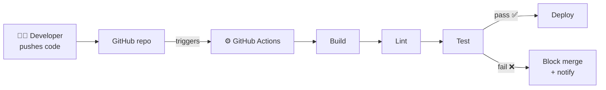

**GitHub Actions** is GitHub's **built-in automation engine**. It lives inside your repository — no separate server like Jenkins to maintain. You describe *what should happen and when* in a YAML file, and GitHub runs it on a machine it provides for free (within limits).

**The mental model — remember these 5 words:**

| Term | Meaning |
|------|---------|
| **Event** | Something that happens (a push, a PR, a schedule, a button click). |
| **Workflow** | The automated process, defined in a `.yml` file, that runs when an event fires. |
| **Job** | A group of steps that run together on one runner. A workflow can have many jobs. |
| **Step** | A single task: either a shell command (`run`) or a reusable action (`uses`). |
| **Runner** | The virtual machine that executes a job. |

> **Pricing note:** GitHub Actions is **free for public repositories**. Private repos get a monthly free allotment of minutes/storage, then pay-as-you-go. See [About billing for Actions](https://docs.github.com/en/billing/managing-billing-for-github-actions/about-billing-for-github-actions).

---

## 2 — YAML in 10 minutes

Workflow files are written in **YAML** (`.yml` or `.yaml`). YAML is just a way to write structured data that's easy for humans to read. You only need a handful of rules:

```yaml
# 1. Comments start with a hash.

# 2. Key-value pairs use a colon + space:
name: My Workflow

# 3. INDENTATION defines structure. Use SPACES, never TABs.
#    (2 spaces per level is the convention.)
jobs:
  build:
    runs-on: ubuntu-latest

# 4. A list (sequence) uses dashes:
branches:
  - main
  - develop
# ...or inline (flow) style:
branches: [main, develop]

# 5. A map (object) is a set of key-values:
with:
  node-version: '20'
  cache: 'npm'

# 6. Multi-line strings:
run: |          # the "|" keeps line breaks (each line runs)
  echo "line 1"
  echo "line 2"
```

**The #1 beginner mistake:** wrong indentation, or using a **TAB** instead of spaces. YAML will reject tabs. When in doubt, count your spaces.

> 🧰 **Validate before you commit:** paste your YAML into [yamllint.com](http://www.yamllint.com/) or the [GitHub Actions VS Code extension](https://marketplace.visualstudio.com/items?itemName=github.vscode-github-actions) to catch indentation errors early.

---

## 3 — Anatomy of a workflow

Every workflow follows the same shape. Here is the hierarchy:

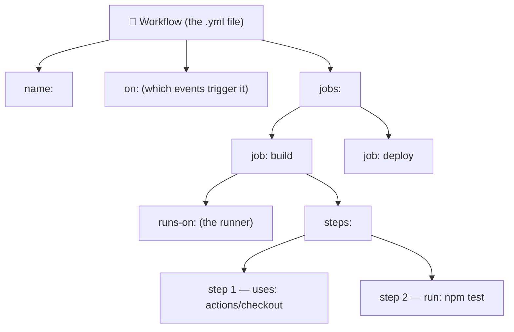

**How a run actually executes:**

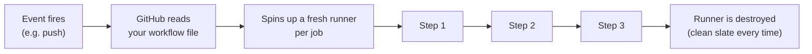

**Key facts to internalize:**

- Jobs run **in parallel** by default (unless you connect them — section 13).
- Steps within a job run **in order, top to bottom**.
- Each job gets a **brand-new, clean runner**. Nothing carries over between jobs unless you explicitly pass it.
- If any step fails, the remaining steps are **skipped** and the job is marked failed (by default).

### ▶️ Example — [`01-hello-world.yml`](day-01/workflows/01-hello-world.yml)

The smallest possible workflow. It has one job, `say-hello`, with two steps.

**Do this now:**

1. Create `.github/workflows/01-hello-world.yml` in the browser, paste the file.
2. Go to **Actions → 01 - Hello World → Run workflow** (because it uses `workflow_dispatch`).
3. Click into the run and read the log of each step.

**What to observe:** the two steps run in order; the second step reads built-in variables like `$RUNNER_OS`.

---

## 4 — Triggers — the `on` keyword

`on:` decides **when** your workflow runs. This is the single most important keyword to master. Below are the events you'll use daily.

### 4.1 `push` — [`02-on-push.yml`](day-01/workflows/02-on-push.yml)

Runs on every push. The classic "test my code as soon as it changes" trigger.

### 4.2 `pull_request` — [`03-on-pull-request.yml`](day-01/workflows/03-on-pull-request.yml)

Runs when a PR is opened or updated. This is how you gate code **before** it merges. Try it: create a new branch in the browser, edit a file, and open a PR — watch the workflow run on the PR.

### 4.3 Filters: branches & paths — [`04-on-branches-paths.yml`](day-01/workflows/04-on-branches-paths.yml)

Only run when it matters — e.g., only on `main`, or only when files under `sample-app/` change. Saves minutes and noise.

> ⚠️ **`paths` are matched from the repo root.** Since our app sits in `sample-app/`, the filter has to say `sample-app/**`. Writing `src/**` would match nothing and the workflow would silently never run — a genuinely confusing bug to chase.
>
> ⚠️ Use **either** `branches` **or** `branches-ignore`, never both. Same for `paths`/`paths-ignore`.

### 4.4 `workflow_dispatch` — [`05-on-workflow-dispatch.yml`](day-01/workflows/05-on-workflow-dispatch.yml)

Adds a manual **"Run workflow"** button, optionally with **inputs** (dropdowns, text, checkboxes). Perfect for deployments and one-off tasks.

### 4.5 `schedule` (cron) — [`06-on-schedule.yml`](day-01/workflows/06-on-schedule.yml)

Run on a timer — nightly builds, health checks, cleanups. **Times are in UTC.** Build cron expressions with [crontab.guru](https://crontab.guru).

### 4.6 Combine them — [`07-on-multiple-events.yml`](day-01/workflows/07-on-multiple-events.yml)

Real workflows listen to several events at once: push to `main` + every PR + a manual button. This is the standard CI setup.

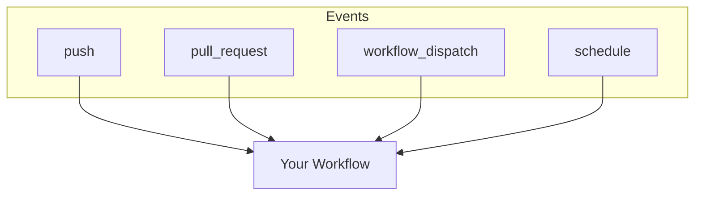

> 📖 Full event list: [Events that trigger workflows](https://docs.github.com/en/actions/reference/events-that-trigger-workflows).

---

## 5 — Runners — the `runs-on` keyword

A **runner** is the virtual machine that executes your job. GitHub hosts fresh runners for you: **Linux, Windows, and macOS**, each pre-loaded with common tools (Git, Node, Python, Docker, etc.).

### ▶️ Example — [`08-runs-on-and-runner-context.yml`](day-01/workflows/08-runs-on-and-runner-context.yml)

Shows three jobs, one per OS, each printing details about its runner.

| Label | Use it for | Notes |
|-------|-----------|-------|
| `ubuntu-latest` | 90% of jobs | Fastest, cheapest — **default choice**. |
| `windows-latest` | Windows-specific builds | Default shell is PowerShell. |
| `macos-latest` | iOS/macOS builds | Uses more billed minutes. |

> **Self-hosted runners** (your own machines) exist for special needs. For everything here, GitHub-hosted runners are perfect.
>
> 📖 [About GitHub-hosted runners](https://docs.github.com/en/actions/using-github-hosted-runners/about-github-hosted-runners/about-github-hosted-runners).

---

## 6 — Steps: `run` vs `uses`

Every step does exactly **one** of two things:

| Keyword | What it does | Example |
|---------|--------------|---------|
| `run:` | Runs shell command(s) on the runner. | `run: npm test` |
| `uses:` | Runs a prebuilt **action** (reusable code). | `uses: actions/checkout@v5` |

You pass **inputs** to a `uses:` action with the `with:` block.

### ▶️ Example — [`09-run-vs-uses.yml`](day-01/workflows/09-run-vs-uses.yml)

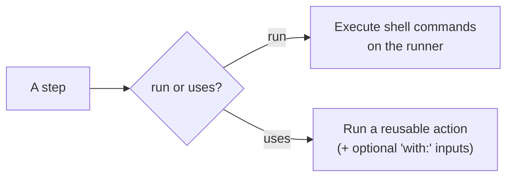

---

## 7 — Marketplace actions: checkout & setup-node

**Actions** are reusable units of automation published to the [GitHub Marketplace](https://github.com/marketplace?type=actions). Instead of writing everything from scratch, you `uses:` an action. Two you'll use constantly:

### 7.1 `actions/checkout` — [`10-checkout.yml`](day-01/workflows/10-checkout.yml)

**The most important thing to understand here:** a fresh runner does **not** have your code on it. It's empty. `actions/checkout` clones your repo onto the runner so later steps can see your files. **Almost every job starts with it.**

The example proves it: one job lists files *without* checkout (empty) and another *with* checkout (your files appear).

```yaml
- uses: actions/checkout@v5    # current major version
```

### 7.2 `actions/setup-node` — [`11-setup-node.yml`](day-01/workflows/11-setup-node.yml)

Installs a chosen Node.js version and puts it on the PATH. There's an equivalent for every ecosystem: `setup-python`, `setup-java`, `setup-go`, etc.

```yaml
- uses: actions/setup-node@v6    # current major version
  with:
    node-version: '20'
    cache: 'npm'                 # cache npm downloads to speed up future runs
    cache-dependency-path: 'sample-app/package-lock.json'   # WHERE the lockfile lives
```

> ⚠️ **`cache: 'npm'` needs a lockfile, and it needs to know where it is.** By default `setup-node` only looks in your repo **root**. Our app lives in `sample-app/`, so we point at it with `cache-dependency-path`. Miss this and the step fails with *"Dependencies lock file is not found"* — even though the file is sitting right there in the repo.
>
> The path is always relative to the **repo root** (not to any `working-directory`), and the file must exist **after checkout** — which is why `actions/checkout` always runs first.
>
> Good news: [`sample-app/`](sample-app/) already ships a ready-made `package-lock.json`, so you never have to generate one.
>
> **Version pinning (`@v5`, `@v6`):** the `@` picks which version of the action to run. Using the **major tag** (`@v5`) gets the latest v5.x. For maximum security, teams pin to a **full commit SHA** — a supply-chain topic covered later in the series.
>
> 📖 [`actions/checkout`](https://github.com/actions/checkout) · [`actions/setup-node`](https://github.com/actions/setup-node) · [Finding and customizing actions](https://docs.github.com/en/actions/learn-github-actions/finding-and-customizing-actions).

---

# Day 2 — From one job to a real pipeline

**Goal:** master custom variables, contexts and secrets, ship a complete single-job CI pipeline, then turn it into a **multi-job pipeline** — parallel jobs connected with `needs`, made conditional with `if` and status functions.

The workflow files continue in [`day-02/workflows/`](day-02/workflows/).

## 8 — Environment variables & scopes

### ▶️ [`12-env-scopes.yml`](day-02/workflows/12-env-scopes.yml)

`env:` defines your own variables at **three levels**. Inner scopes override outer ones.

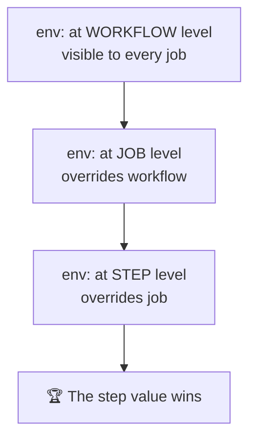

Read them two ways — and the difference matters:

| Syntax | Evaluated by | When to use |
|--------|--------------|-------------|
| `$NAME` | the **shell**, at runtime | inside `run:` |
| `${{ env.NAME }}` | **GitHub**, before the step starts | in `if:`, `with:`, `name:` |

**What to observe:** a variable defined at all three levels prints the **step** value; a variable defined only at workflow level is visible everywhere; and a job that defines its own value shadows the workflow one — but only for that job.

> ⚠️ Anything in `env:` is plain text and fully visible in logs. Credentials go in secrets (section 10), not here.

---

## 9 — Contexts & expressions

### ▶️ [`13-contexts.yml`](day-02/workflows/13-contexts.yml)

**Contexts** are read-only objects full of information about the run, accessed with `${{ ... }}`.

| Context | Gives you | Example |
|---------|-----------|---------|
| `github` | repo, event, actor, ref, sha, run number | `${{ github.repository }}` |
| `runner` | OS, arch, temp dirs | `${{ runner.os }}` |
| `env` | your custom variables | `${{ env.APP_NAME }}` |
| `secrets` | your stored secrets | `${{ secrets.MY_API_KEY }}` |
| `vars` | your repository variables | `${{ vars.YOUTUBE }}` |
| `needs` | upstream jobs' results & outputs | `${{ needs.build.result }}` |

💡 **The debugging trick worth remembering:**

```yaml
- env:
    GITHUB_CONTEXT: ${{ toJSON(github) }}
  run: echo "$GITHUB_CONTEXT"
```

Dump the whole context as JSON and read what's actually available, instead of guessing. (You'll use the same `toJSON()` trick on the `needs` context in section 13.)

> ⚠️ **Not every context is available everywhere.** `secrets` doesn't exist at workflow level, and `needs` doesn't exist without a `needs:` key. The [context availability table](https://docs.github.com/en/actions/learn-github-actions/contexts#context-availability) is the reference to bookmark.

---

## 10 — Secrets & variables

### ▶️ [`14-secrets.yml`](day-02/workflows/14-secrets.yml)

Never hard-code a token in a workflow file — the file lives in your git history forever.

**Create a secret:** `Settings → Secrets and variables → Actions → New repository secret` → name it `MY_API_KEY`.
**Create a variable:** the **Variables** tab, right next to it → name it `YOUTUBE`.

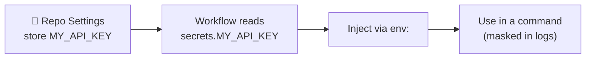

**Golden rules of secrets:**

- ✅ GitHub **masks** secret values in logs — they appear as `***`.
- ✅ Pass secrets through `env:` and consume them in a command. Don't `echo` them.
- ⚠️ Secrets are **not** sent to workflows triggered by pull requests **from forks**.
- 🔑 `GITHUB_TOKEN` is an automatic secret you never create — used to talk to the GitHub API.

**Secrets vs variables** — same UI, opposite purpose:

| | `secrets.X` | `vars.X` |
|---|---|---|
| Encrypted | ✅ | ❌ |
| Masked in logs | ✅ (`***`) | ❌ (printed in full) |
| Use for | tokens, passwords, keys | URLs, channel names, feature flags |

The example reads both: a **secret** (`MY_API_KEY`, masked) and a **variable** (`vars.YOUTUBE`, printed in the clear). Putting a URL in a secret is a common mistake — masking it turns your logs into a wall of `***`.

---

## 11 — 🚀 Your first CI pipeline (capstone)

### ▶️ [`15-node-ci-combined.yml`](day-02/workflows/15-node-ci-combined.yml)

Now combine **everything so far**: triggers, a runner, checkout, setup-node, `env`, contexts and a real install → lint → test flow, against the [`sample-app/`](sample-app/) at the repo root.

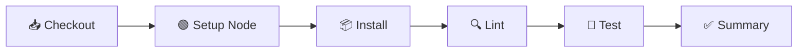

**The subfolder rule** — our code isn't at the repo root, it's in `sample-app/`. A `run:` step always starts at the repo root, so set the working directory once for the whole job:

```yaml
jobs:
  build-and-test:
    defaults:
      run:
        working-directory: sample-app   # every `run:` step starts here
```

> 🔑 **The catch that trips everyone up:** `defaults.run.working-directory` applies to **`run:` steps only**. Paths given to a `uses:` action are **always** relative to the repo root — which is why the same folder name appears twice, in two forms:

| Setting | Applies to | Value | Relative to |
|---|---|---|---|
| `defaults.run.working-directory` | every `run:` step | `sample-app` | repo root |
| `cache-dependency-path` | the `setup-node` **action** | `sample-app/package-lock.json` | repo root |

**Break it on purpose to learn to read failures:** change `assert.equal(add(2, 3), 5)` to `6` in `test/math.test.js`, commit, read the red step, fix it back to `5`, commit again → green.

**Status badge (optional flex)** — put this near the top of your practice repo's README (replace `USER/REPO`):

```markdown

```

---

## 12 — Many jobs run in parallel

### ▶️ [`16-parallel-jobs.yml`](day-02/workflows/16-parallel-jobs.yml)

Add a second job and GitHub starts it **immediately, in parallel, on a completely separate machine**.

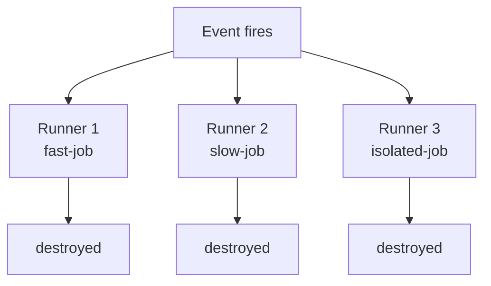

**The two facts that matter:**

1. **Order in the file means nothing.** Writing a job last does not make it run last. Only `needs:` creates order (section 13).
2. **Nothing is shared.** Not files, not installed tools, not environment variables. A file written in job A is gone forever as far as job B is concerned. To pass data between jobs you need **outputs** or **artifacts** (coming up later in the series).

**What to observe:** the graph view shows three boxes side by side, all starting at the same second.

---

## 13 — `needs` — building a pipeline

### ▶️ [`17-needs-dependencies.yml`](day-02/workflows/17-needs-dependencies.yml)

`needs:` is the keyword that turns a pile of jobs into a pipeline: *"don't start until those finished successfully."*

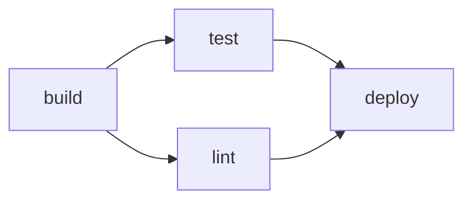

```yaml
jobs:
  build: { ... }
  test:   { needs: build }          # single dependency
  lint:   { needs: build }          # runs in parallel with test
  deploy: { needs: [test, lint] }   # fan-in: waits for BOTH
```

**Rules worth memorising:**

- A failed dependency makes downstream jobs **skipped** (grey), not failed — override with `always()` (section 15).
- You get the `needs` context: `needs.<job>.result` and `needs.<job>.outputs.<name>`.
- Cycles are rejected before the workflow runs.

💡 Same debugging trick as contexts — dump the whole thing to see what a job inherited from its dependencies:

```yaml
- env:
    NEEDS_DATA: ${{ toJSON(needs) }}
  run: echo "$NEEDS_DATA"
```

**What to observe:** `deploy` sits idle until both `test` and `lint` finish. In the example `lint` fails on purpose (`exit 1`) — watch `deploy` turn **grey (skipped), not red**. Downstream jobs are skipped when a dependency fails, and a skipped job does not by itself fail the run.

---

## 14 — `if` — conditional jobs and steps

### ▶️ [`18-if-conditionals.yml`](day-02/workflows/18-if-conditionals.yml)

`if:` sits on a **job** or a **step**. False → skipped, and skipped is not failed.

```yaml
if: github.event_name == 'push' && github.ref == 'refs/heads/main'
```

Operators: `==` `!=` `&&` `||` `!`, plus `contains()`, `startsWith()`, `endsWith()`.

> ⚠️ **The gotcha that costs everyone an hour.** `if:` is *already* an expression context, so `${{ }}` is optional — but quoting is not harmless:
>
> | You write | GitHub sees |
> |---|---|
> | `if: ${{ false }}` | false ✅ |
> | `if: false` | false ✅ |
> | `if: 'false'` | **TRUE** — a non-empty string, and every non-empty string is truthy ❌ |
>
> Write conditions **without** `${{ }}` and **never quote booleans**.

**What to observe:** run it manually, then push to `main`, and compare which jobs are grey in each run.

---

## 15 — Status functions

### ▶️ [`19-status-functions.yml`](day-02/workflows/19-status-functions.yml)

Four functions let a job react to what happened before it:

| Function | True when |
|---|---|
| `success()` | nothing so far failed — **the invisible default** |
| `failure()` | something upstream failed |
| `cancelled()` | the run was cancelled |
| `always()` | always, including cancellation |

**The rule that explains all the confusing behaviour:**

> Every job and step has an invisible `if: success()` on it. That's why a job whose `needs` failed turns grey. The moment you write a status function yourself, that default is **removed** and your expression alone decides.

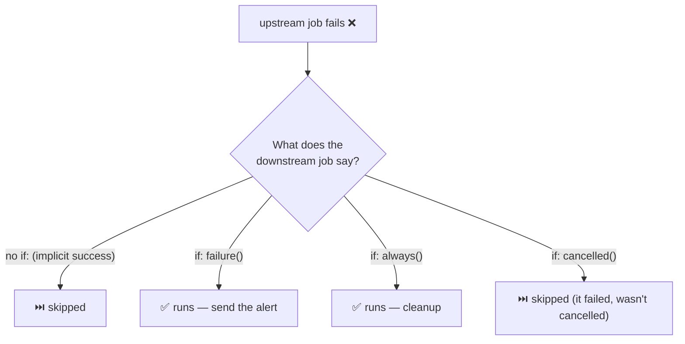

**Where you actually use this:** Slack alerts on failure, uploading logs from a failed run, and teardown jobs that must destroy infrastructure even when the deploy exploded.

**What to observe:** the first job fails on purpose — see which of the reporter jobs are green and which are grey. A common real-world variant is in the file too: `if: failure() && github.ref == 'refs/heads/main'` — alert, but only when it's `main` that broke.

---

# Day 3 — Production pipelines: reuse, security & gated deploys

**Goal:** take the multi-job pipeline from the previous day and make it *production-grade* — pass data between jobs with **outputs**, test across a **matrix**, **cache** dependencies and share files with **artifacts**, stop copy-pasting YAML with **reusable workflows** and **composite actions**, lock down `GITHUB_TOKEN` with least-privilege **permissions**, gate deploys behind a **human approval** with environments, and control cost with **concurrency** and **timeouts** — ending in a full **build → test → deploy** capstone.

The workflow files are in [`day-03/workflows/`](day-03/workflows/) (`20`–`34`), with the composite action in [`day-03/actions/`](day-03/actions/).

## 16 — Job outputs — passing values between jobs

### ▶️ [`20-job-outputs.yml`](day-03/workflows/20-job-outputs.yml)

Every job runs on its own machine (section 12), so a variable you set in job A simply doesn't exist in job B. To move a small **value** — a version number, an image tag, a URL — you use **outputs**. (For a whole *file*, you'll use artifacts — section 21.)

It's a **three-link chain**, and missing the middle link is the #1 mistake:

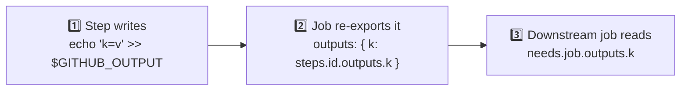

```yaml
jobs:
  produce:
    runs-on: ubuntu-latest
    outputs:                                    # 2️⃣ promote step → job output
      version: ${{ steps.meta.outputs.version }}
    steps:
      - id: meta                                # ← the id is mandatory
        run: echo "version=1.4.${{ github.run_number }}" >> "$GITHUB_OUTPUT"   # 1️⃣
  consume:
    needs: produce                              # 3️⃣ no `needs` = no `needs.produce`
    runs-on: ubuntu-latest
    steps:
      - run: echo "${{ needs.produce.outputs.version }}"
```

> ⚠️ **Facts that bite:** the producing step needs an `id:`. `::set-output::` is dead (disabled 2023) — use `$GITHUB_OUTPUT`. Every output is a **string** (`"true"` is not a boolean). A **secret** smuggled through an output arrives empty. **Multi-line** values need a random delimiter (`key<<EOF … EOF`) or they truncate.

**What to observe:** `consume` prints the version that `produce` computed — and the gate step (`if: needs.produce.outputs.version != ''`) shows how you branch on an output.

---

## 17 — Matrix builds — one job, many versions

### ▶️ [`21-matrix-basics.yml`](day-03/workflows/21-matrix-basics.yml)

*"Does my code work on Node 20, 22 **and** 24?"* Without a matrix you'd copy-paste the job three times. `strategy.matrix` writes it **once** and GitHub expands it into one parallel job per value.

```yaml
strategy:
  matrix:
    node: [20, 22, 24]        # → 3 jobs, each with its own ${{ matrix.node }}
```

The matrix values become the `matrix` context — usable in `with:`, `run:`, `if:`, even the job `name:`.

> 💡 **Always template the job `name:`** with the matrix values (`name: Test on Node ${{ matrix.node }}`). Otherwise the Actions tab shows three identical rows and you can't tell which one broke. **Limit:** 256 jobs per matrix.

**What to observe:** three jobs, three different `node --version` outputs, all finishing at roughly the same time.

---

## 18 — Multi-dimension matrices: `include` & `exclude`

### ▶️ [`22-matrix-multi-dimension.yml`](day-03/workflows/22-matrix-multi-dimension.yml)

Two matrix keys **multiply** — a Cartesian product. `3 OSes × 3 Node versions = 9 jobs`, nine runners. macOS is billed at **10×** on private repos, so trimming the grid is a real cost decision.

| Key | What it does |
|---|---|
| `exclude:` | Removes specific combinations from the grid. |
| `include:` (matches an existing combo) | **Adds variables** to that job (no new job). |
| `include:` (matches nothing) | **Appends a brand-new job** outside the grid. |

> ⚠️ **Order:** `exclude` is applied **first**, then `include` — so `include` can add back something you just excluded. This asymmetry trips everyone up once.

**What to observe:** count the jobs. `3×3 = 9`, minus 2 excluded = 7, plus 1 appended (`node: 18`, legacy) = **8**. Note `fail-fast: false` here so every row runs to completion.

---

## 19 — Controlling a matrix: `fail-fast` & `max-parallel`

### ▶️ [`23-matrix-fail-fast-max-parallel.yml`](day-03/workflows/23-matrix-fail-fast-max-parallel.yml)

| Setting | Default | What it does |
|---|---|---|
| `fail-fast` | `true` | The moment **one** matrix job fails, GitHub **cancels all the others**. Fast feedback, but you never learn if the other versions broke too. |
| `max-parallel` | (all at once) | Caps how many matrix jobs run simultaneously — for a shared test DB, a rate-limited API, or a small runner pool. |

**What to observe:** the `node: 18` row fails on purpose. With `fail-fast: false` all four rows finish and only 18 is red. Flip it to `true`, re-run, and watch the others get **cancelled mid-flight**. With `max-parallel: 2`, two rows sit in **Queued** until a slot frees up.

---

## 20 — Caching dependencies

### ▶️ [`24-cache-dependencies.yml`](day-03/workflows/24-cache-dependencies.yml)

Every job starts on a blank runner, so `npm ci` re-downloads the whole dependency tree **every run** — 60–180 seconds of pure waiting, forever. A **cache** saves a directory at the end of a run and restores it at the start of the next.

Two ways, and you should reach for the first:

```yaml
# A — built-in (covers 90% of Node projects, zero key management)
- uses: actions/setup-node@v6
  with: { node-version: '20', cache: 'npm', cache-dependency-path: 'sample-app/package-lock.json' }

# B — actions/cache@v6 (full control over any directory)
- uses: actions/cache@v6
  with:
    path: ~/.my-tool-cache
    key: ${{ runner.os }}-tools-${{ hashFiles('sample-app/package-lock.json') }}
    restore-keys: |
      ${{ runner.os }}-tools-
```

**How the key works — this is the whole concept:** `key` is an exact-match lookup. **Hit** → restore and skip the save. **Miss** → run the steps, then save under this key. `restore-keys` are prefixes tried only on a miss — a partial hit gives a slightly stale cache, still better than downloading everything.

> ⚠️ **The classic bug:** a key like `npm-cache` with **no `hashFiles()`** is written once and then *never updates again*, no matter how much `package.json` changes — because caches are **immutable**. Always hash the lockfile into the key. Also: `cache-hit` is `'true'` only on an **exact** `key` match, not a `restore-keys` hit.
>
> **Cache vs artifact:** *cache* = "I could rebuild this, I just don't want to wait." *Artifact* (next) = "This **is** the result; losing it loses the work." **Limits:** 10 GB/repo (LRU eviction), 7-day idle deletion, and a branch can read its own + the default branch's caches, never a sibling's.

**What to observe:** run it **twice**. First run: *"Cache not found"*, slow path. Second run: *"Cache restored from key…"*, slow step skipped.

---

## 21 — Artifacts — sharing files between jobs

### ▶️ [`25-artifacts-basics.yml`](day-03/workflows/25-artifacts-basics.yml)

Outputs move a string; **artifacts move real files** — a compiled bundle, a test report, a screenshot, a log. The flow is always the same two actions:

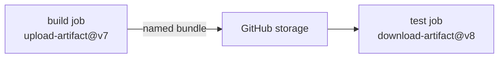

```yaml
- uses: actions/upload-artifact@v7
  with:
    name: app-build
    path: sample-app/dist/       # ⚠️ ALWAYS relative to repo root — working-directory does NOT apply
    if-no-files-found: error     # 'warn' (default) hides a broken build
# ...in a later job:
- uses: actions/download-artifact@v8
  with: { name: app-build, path: downloaded-build }
```

> ⚠️ **The two actions are not on the same major — upload is `v7`, download is `v8`.** They ship independently; don't "fix" the mismatch. Anything at or below `upload@v5` / `download@v6` runs on Node 20, and GitHub now prints *"Node.js 20 is deprecated… being forced to run on Node.js 24"* — that warning is your cue to bump the major. (Self-hosted runners need **2.327.1+** for the Node 24 builds.) The v3 artifact actions were **fully retired on 30 Jan 2025** and fail outright, so older tutorials are broken.

> **The rules that define artifacts** (unchanged since v4): artifacts are **immutable** — a second upload to the same name **fails** unless you pass `overwrite: true`; names must be **unique** per run; and each artifact is downloadable the moment its job finishes. Newer since: `upload@v7` adds `archive: false` to upload a single file un-zipped, and `download@v8` verifies the SHA-256 digest and **fails on a mismatch by default** (`digest-mismatch: ignore|info|warn|error`).

> 📋 **Setup:** this one runs `npm run build`. If your practice repo dates from Day 1 you have the older `sample-app` and the build job dies with `npm error Missing script: "build"` — re-copy **`sample-app/package.json`** and **`sample-app/build.js`**. The lockfile is unchanged (adding a *script* doesn't invalidate it), which is why `npm ci` passes and only the build step fails.

**What to observe:** the run summary has an **Artifacts** box you can download in the browser. The `download-artifact` job proves the files crossed the machine boundary onto a fresh runner with no checkout. A third job uses `if: failure()` to rescue logs from a broken run — the real-world reason artifacts matter.

---

## 22 — Matrix artifacts & merging

### ▶️ [`26-artifacts-matrix-and-merge.yml`](day-03/workflows/26-artifacts-matrix-and-merge.yml)

Put an upload **inside a matrix** with a fixed `name:` and rows 2 and 3 fail:

> `Conflict: an artifact with this name already exists on the workflow run`

Because artifact names are immutable/unique, this is the **single most common migration breakage**. The fix has two halves:

1. **Upload under a unique name per row** — include every matrix dimension: `name: report-node-${{ matrix.node }}` (a 2-D grid needs `report-${{ matrix.os }}-${{ matrix.node }}`).
2. **Optionally merge** them back:

| Method | Result | Best when |
|---|---|---|
| `actions/upload-artifact/merge@v7` (with `pattern:`) | A new combined artifact in the UI | A human downloads one zip |
| `download-artifact` + `pattern:` + `merge-multiple: true` | All files onto one runner | A later **job** processes them |

**What to observe:** the run lists `report-node-20/22/24`, then a single `all-test-reports` after the merge. The summarise job writes a table to `$GITHUB_STEP_SUMMARY` — an underused way to surface results without opening logs.

---

## 23 — Reusable workflows — reuse a whole job

### ▶️ callee [`27-reusable-workflow-callee.yml`](day-03/workflows/27-reusable-workflow-callee.yml) · caller [`28-reusable-workflow-caller.yml`](day-03/workflows/28-reusable-workflow-caller.yml)

Copy-pasting the same "checkout, setup-node, install, test" into eight repos is how CI rots. Write it **once** and call it like a function. The `workflow_call` trigger is what makes a workflow callable, with a **typed interface**:

```yaml
# callee (27) — the reusable workflow
on:
  workflow_call:
    inputs:
      node-version: { type: string, required: false, default: '20' }   # `type` is MANDATORY here
      run-lint:     { type: boolean, required: false, default: true }   # a real boolean
    secrets:
      API_KEY: { required: false }        # declared explicitly — nothing leaks in
    outputs:
      tested-version: { value: ${{ jobs.run-tests.outputs.node-version }} }
```

You call it **from the job level** — not from a step:

```yaml
# caller (28)
jobs:
  test-node-22:
    uses: ./.github/workflows/27-reusable-workflow-callee.yml   # job-level `uses:`
    with: { node-version: '22', run-lint: false }
    secrets: { API_KEY: ${{ secrets.MY_API_KEY }} }             # or `secrets: inherit` (over-shares)
```

> ⚠️ **The shape that surprises everyone:** a job with `uses:` must **not** have `steps:` or `runs-on:` — the called workflow brings its own. The only keys allowed alongside it: `with`, `secrets`, `needs`, `if`, `permissions`, `strategy`, `concurrency`. Because `strategy` is allowed, you can **matrix a reusable-workflow call**. **Rules:** it must live in `.github/workflows/` (no subfolders), nesting caps at 4, and caller `env` does **not** reach the callee — pass it as an input.

**📋 To run the demo:** copy **both** 27 and 28 into `.github/workflows/`.

**What to observe:** the run graph shows the caller's jobs with the **callee's jobs nested inside**. The `report` job reads the callee's output via `needs.test-defaults.outputs.tested-version`.

---

## 24 — Composite actions — reuse a few steps

### ▶️ [`29-composite-action-demo.yml`](day-03/workflows/29-composite-action-demo.yml) + [`action.yml`](day-03/actions/node-ci-setup/action.yml)

A **composite action** collapses several repeated *steps* into one. Compare the two jobs in the demo: `the-long-way` spells out three steps; `the-short-way` does the same in one `uses:`.

```yaml
# .github/actions/node-ci-setup/action.yml
runs:
  using: composite               # ← this is what makes it composite (not node20)
  steps:
    - uses: actions/setup-node@v6
      with: { node-version: ${{ inputs.node-version }}, cache: 'npm', cache-dependency-path: ${{ inputs.working-directory }}/package-lock.json }
    - shell: bash                 # ← MANDATORY on every run step, no default
      run: npm ci
```

```yaml
# in the caller — checkout FIRST, then the local action
- uses: actions/checkout@v5
- uses: ./.github/actions/node-ci-setup     # a PATH, no @version
  with: { node-version: '22' }
```

> ⚠️ **The chicken-and-egg rule:** a local action (`uses: ./…`) is just a file in your repo, so it doesn't exist on the runner until `actions/checkout` has run. Forget it and you get *"Can't find 'action.yml' under …"*. Also: every `run:` step needs `shell:`, and there's **no `secrets` context** — pass secrets as inputs.

**When to use which — the exam question:**

| | Composite action | Reusable workflow |
|---|---|---|
| Unit of reuse | a few **steps** | whole **jobs** |
| Called from | a **step** (`uses:`) | a **job** (`uses:`) |
| Picks the runner? | no — inherits | yes — brings its own |
| Own `permissions` / matrix? | no | yes |
| Lives in | any folder | `.github/workflows/` only |
| Sees `secrets`? | no (pass inputs) | yes (declared) |

Rule of thumb: repeating **steps** → composite action; repeating a whole **job** → reusable workflow; need real logic/an API call → a JavaScript action (later in the series).

**📋 To run the demo:** copy this file **and** `.github/actions/node-ci-setup/action.yml` into your repo.

---

## 25 — `GITHUB_TOKEN` & least-privilege `permissions`

### ▶️ [`30-token-permissions.yml`](day-03/workflows/30-token-permissions.yml)

Every run gets a token it never asked for: GitHub mints a fresh `GITHUB_TOKEN`, injects it as `secrets.GITHUB_TOKEN`, and destroys it when the run ends. It lets you call the GitHub API **as the repo** — no personal token needed. The risk: by default it may be allowed to **write**, and a compromised third-party action in your job inherits it — the exact mechanism behind the supply-chain attacks covered later in the series.

```yaml
permissions:            # at the TOP of every workflow you write from now on
  contents: read        # read the repo…
  # …and nothing else
```

> 🔑 **The rule that makes this safe:** specifying `permissions:` **at all** sets every scope you *didn't* list to `none` — it is **not additive**. So a two-line block is already least-privilege; you never enumerate the other 15 scopes.

| Shortcut | Meaning |
|---|---|
| `permissions: read-all` | every scope read (fine for most CI) |
| `permissions: write-all` | every scope write (avoid) |
| `permissions: {}` | nothing at all (pure compute jobs) |

Put it at workflow level (all jobs) or per job (overrides the workflow). **Best practice:** read-only at the top, then elevate the one job that must write.

**What to observe:** expand **"Set up job"** in each job's log — GitHub prints the exact scopes granted. The `zero-permissions` job proves the restriction by attempting a **write** (creating an issue) and getting a clean **403** — a write is denied unambiguously, whereas a public-repo read would succeed even with no scopes.

---

## 26 — Environments & approvals

### ▶️ [`31-environments-and-approvals.yml`](day-03/workflows/31-environments-and-approvals.yml)

An **environment** is a named deployment target — `staging`, `production` — that gives a job three things a plain job lacks: its own **scoped secrets/variables**, **protection rules** (required approvals, wait timers, branch policies), and **deployment history**.

```yaml
deploy-production:
  needs: deploy-staging
  environment:
    name: production          # ← the required reviewer on this env IS the gate
    url: ${{ vars.API_URL }}  # renders as a clickable link on the run page
  steps:
    - env: { DEPLOY_TOKEN: ${{ secrets.DEPLOY_TOKEN }} }   # resolves to the PRODUCTION value
      run: echo "deploying…"
```

> 🔑 **Secret precedence — most specific wins:** `environment > repository > organization`. Both environments define `DEPLOY_TOKEN` under the **same name**; the job that says `environment: staging` transparently gets the staging value. One workflow, one secret name, different values per target — **no `if` picking secret names**.

**📋 Setup (Settings → Environments):** create `staging` and `production`, each with a `DEPLOY_TOKEN` secret and an `API_URL` variable; on `production` add **yourself as a required reviewer**, and optionally a wait timer + a `main`-only branch policy.

**What to observe:** the run **pauses** at `deploy-production` with a yellow "Waiting" badge and a **Review deployments** button — nothing runs until you click Approve. The `environment:` key *is* the entire gate; there's no approval step to write. Branch policies are enforced by GitHub, not your `if:` — so they can't be bypassed by editing the workflow.

---

## 27 — Concurrency — cancel stale runs, serialise deploys

### ▶️ [`32-concurrency.yml`](day-03/workflows/32-concurrency.yml)

`concurrency` solves two problems that pull in opposite directions. Every run joins a named **group**; only one run per group executes at a time.

| Problem | Setting |
|---|---|
| **Waste** — three pushes to a PR start three CI runs; the first two are already stale. Kill them. | `cancel-in-progress: true` |
| **Race conditions** — two merges to main trigger two deploys fighting over one server. Queue them. | `cancel-in-progress: false` |

```yaml
# Standard "cancel stale CI" — per workflow, per branch
concurrency:
  group: ${{ github.workflow }}-${{ github.ref }}
  cancel-in-progress: true
```

**Choosing the group key is the whole design decision:** include `github.ref` for CI (one run per branch); **leave it out** for deploys (`group: production-deploy`) so *all* deploys serialise. You can even compute the flag: `cancel-in-progress: ${{ github.event_name == 'pull_request' }}` cancels stale PR builds but lets main finish.

> ⚠️ **The queue is one deep:** per group there's one running + one pending. Queue a third and it **replaces** the pending one. Concurrency is not a durable job queue — don't use it as one.

**What to observe:** run it from the button, then immediately run it again — the first run flips to **Cancelled** the moment the second starts.

---

## 28 — Timeouts & `continue-on-error`

### ▶️ [`33-timeout-and-continue-on-error.yml`](day-03/workflows/33-timeout-and-continue-on-error.yml)

A job's **default timeout is 360 minutes** — six hours. A hung test or a command waiting on input will happily burn all six hours of billed time. `timeout-minutes` is the cheapest insurance in CI — set it to ~2–3× normal runtime.

```yaml
jobs:
  build:
    timeout-minutes: 5        # ← put this on EVERY job (cancels the whole job)
    steps:
      - timeout-minutes: 1    # on a STEP: cancels just that step, fails the job
        run: ./maybe-hangs.sh
```

`continue-on-error` marks a step (or job) as *"may fail, don't fail the run over it"* — for genuinely optional work (a flaky coverage upload, an experimental matrix row). **Don't** use it to silence a failing test; that's how a green pipeline stops meaning anything.

> 🔑 **`outcome` vs `conclusion` — the distinction that makes it usable:** `steps.<id>.outcome` = what **actually** happened (`failure`); `steps.<id>.conclusion` = what was **reported** after `continue-on-error` (`success`). To react to a real failure, check **`outcome`** — checking `conclusion` silently never matches, and people lose an afternoon to it.

**What to observe:** the job goes **green overall**, but the hung step shows a red-with-arrow icon and is cancelled at 1 minute; the optional-upload job reads `outcome == 'failure'` to log without blocking. The experimental Node 23 matrix row fails without turning the run red (`continue-on-error: ${{ matrix.experimental }}`).

---

## 29 — 🚀 The production pipeline (capstone)

### ▶️ [`34-pipeline-capstone.yml`](day-03/workflows/34-pipeline-capstone.yml)

Everything from this day in one file a real team would ship:

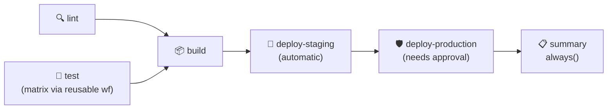

It combines least-privilege `permissions`, PR-only `concurrency` cancellation, a `lint` + matrix `test` (delegated to the reusable workflow from section 23) fanning into a single `build`, job **outputs** for the version, an **artifact** built **once** and deployed to both environments, automatic **staging** + gated **production**, and a `summary` job that runs on `always()`.

> 🔑 **Two production instincts baked in:** ① **build once, deploy the same bytes** everywhere — staging and production download the *same* `app-build-${version}` artifact, killing the "it worked in staging" class of bug. ② `always()` makes `summary` run whatever happened, so it re-checks `contains(needs.*.result, 'failure')` and **exits 1** — otherwise the run could look green even when `build` failed.

**📋 Setup:** copy `sample-app/`, this file, and `27-reusable-workflow-callee.yml` into your repo; create the `staging`/`production` environments (required reviewer on `production`) from section 26.

**What to observe:** `lint` and `test` start together; `build` waits for both; staging deploys automatically; **production sits on "Waiting"** until you Approve; `summary` reports a table to the run summary page whatever the outcome.

---

# Day 4 — Advanced: security, OIDC, custom actions & publishing

**Goal:** harden and scale the pipeline the way production teams do — pin the supply chain, scan code and secrets, authenticate to the cloud with **no stored keys** via OIDC, build your **own actions** (JavaScript and Docker), publish a **Docker image to GHCR**, and version and ship an action — ending in a fully hardened capstone.

The workflow files are in [`day-04/workflows/`](day-04/workflows/) (`35`–`49`), with the custom actions in [`day-04/actions/`](day-04/actions/).

## 30 — Supply-chain security: pin actions to a SHA

### ▶️ [`35-sha-pinning.yml`](day-04/workflows/35-sha-pinning.yml)

`uses: some/action@v1` trusts a **tag**, and a tag is a *movable pointer* — whoever controls the action's repo can silently re-point `v1` at new code that runs with your secrets and `GITHUB_TOKEN`.

> ⚠️ **This is how CI gets compromised.** In March 2025 the popular `tj-actions/changed-files` action was hijacked: its version tags were moved to a malicious commit that dumped CI secrets into build logs. Repos pinned to a **tag** leaked; repos pinned to a full **SHA** were untouched.

```yaml
- uses: actions/checkout@08c6903cd8c0fde910a37f88322edcfb5dd907a8  # v5.0.0
#                        └─ immutable 40-char commit ─┘             └ human note
```

A SHA names one exact commit that can never be swapped. Keep the tag as a trailing comment for humans (GitHub ignores it). **"But then I never get updates"** — that's what **Dependabot** is for: a `.github/dependabot.yml` with `package-ecosystem: "github-actions"` opens a PR that bumps the SHA *and* the comment on each new release, so updates stay deliberate.

> 💡 **How much to pin:** third-party actions → **always SHA**; GitHub's own `actions/*` → a major tag is widely accepted; your own `./.github/...` → nothing to pin (already runs at the current commit). Org/enterprise admins can enforce *"require SHA-pinned actions,"* and **immutable releases** make a tag and SHA equivalent.

---

## 31 — CodeQL code scanning

### ▶️ [`36-codeql-code-scanning.yml`](day-04/workflows/36-codeql-code-scanning.yml)

CodeQL is GitHub's static-analysis engine. It compiles your code into a database and runs security queries (injection, path traversal, hard-coded secrets…), posting findings to the repo's **Security → Code scanning** tab, annotated on the exact line and on PRs.

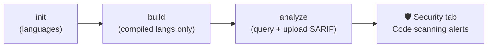

The three steps are always `codeql-action/init` → (build) → `codeql-action/analyze`, matrixed by language. Scan on push/PR **and** on a schedule so newly-published queries re-check old code.

> 🔑 **The permission:** `security-events: write` (to upload results) — miss it and you get *"Resource not accessible by integration."* Free on public repos; needs GitHub Advanced Security on private ones. JS/Python need no build step; compiled languages need `autobuild` or a real build.

---

## 32 — Secret scanning & push protection

### ▶️ [`37-secret-scanning.yml`](day-04/workflows/37-secret-scanning.yml)

Two layers stop credentials reaching the repo:

| Layer | What it does | Where |
|---|---|---|
| **Platform secret scanning + push protection** | Detects known token formats; **push protection blocks the `git push`** before a recognised secret lands | a repo **setting** (no YAML) |
| **A scanner in CI** (here `gitleaks`) | Also catches generic high-entropy strings, private keys, `.env` files, and **fails the build** so a leak can't merge | this workflow |

> ⚠️ **If a secret was ever committed, rotate it.** Deleting the file does nothing — it lives forever in git history, clones, and forks. Treat any committed credential as burned: revoke and reissue. Use `fetch-depth: 0` so the scanner sees the full history, not just the tip.

---

## 33 — Untrusted PRs & `pull_request_target`

### ▶️ [`38-untrusted-pr-hardening.yml`](day-04/workflows/38-untrusted-pr-hardening.yml)

The single most dangerous Actions misconfiguration lives in the difference between two triggers:

| Trigger | Runs code from | Secrets / token | Use for |
|---|---|---|---|
| `pull_request` | the **PR** (fork) | none / read-only on forks | safely building untrusted PRs |
| `pull_request_target` | the **base** branch | **full secrets + write** | tasks needing secrets on fork PRs (labelling) |

> ⚠️ **Poisoned pipeline execution:** a `pull_request_target` workflow that **checks out and runs the PR's code** (`npm ci`, tests, a `postinstall` script) is executing a stranger's code *with your secrets in the environment*. The attacker just edits a script to exfiltrate `${{ secrets.* }}`.

The rules: prefer plain `pull_request`; with `pull_request_target` **never run the PR's code** in the job that holds secrets; never inline untrusted text (PR title/branch) into a `run:` — pass it through `env:` so the shell treats it as data, not code; keep `permissions` least-privilege; require approval for first-time contributors.

---

## 34 — OIDC: keyless cloud authentication

### ▶️ [`39-oidc-cloud-auth.yml`](day-04/workflows/39-oidc-cloud-auth.yml)

Storing a long-lived AWS/GCP/Azure key in repo secrets means one leak = standing cloud access until someone rotates it. **OIDC** removes the stored key entirely: GitHub mints a short-lived, signed token at runtime that *proves* "this is repo X on branch Z"; your cloud trusts GitHub's issuer and swaps that proof for credentials that expire in minutes.

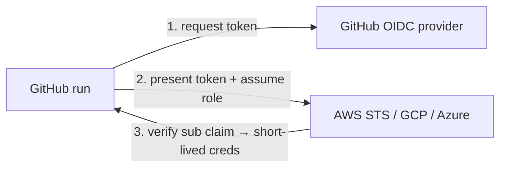

```yaml
permissions:
  id-token: write          # 🔑 the line that makes OIDC possible
# ...
- uses: aws-actions/configure-aws-credentials@v4
  with:
    role-to-assume: ${{ vars.AWS_ROLE_ARN }}   # a variable, not a secret
    aws-region: us-east-1
```

> 🔑 **Scope trust with the `sub` claim.** On the cloud side, don't trust "any GitHub repo" — trust `repo:my-org/my-repo:ref:refs/heads/main` or `:environment:production`. That's what stops a token from a random branch or fork assuming your prod role. Same `id-token: write` for every cloud; only the login action differs (`azure/login`, `google-github-actions/auth`).

---

## 35 — Self-hosted & scaled runners

### ▶️ [`40-self-hosted-runners.yml`](day-04/workflows/40-self-hosted-runners.yml)

Reach for a self-hosted runner — a machine **you** register — only when hosted ones can't do the job: special hardware (GPU/ARM), private-network access, licensed tooling, or very high volume. Target it by **label**: `runs-on: [self-hosted, linux, x64]`.

> ⚠️ **Never attach a self-hosted runner to a public repo** — anyone's PR would run their code on your machine, inside your network. And unlike hosted runners (destroyed after each job), self-hosted ones **persist**: state and malware survive between runs unless you clean up or run each job in a fresh container. Scale with **runner groups** and ephemeral auto-scaling (Actions Runner Controller / runner scale sets), which restore the clean-machine-every-time property.

**What to observe:** the demo sits in **Queued** forever unless a matching runner is online — that wait *is* the `runs-on` label-matching lesson.

---

## 36 — Chaining workflows: `workflow_run` & `repository_dispatch`

### ▶️ [`41-workflow-run-chaining.yml`](day-04/workflows/41-workflow-run-chaining.yml) · [`42-repository-dispatch.yml`](day-04/workflows/42-repository-dispatch.yml)

`needs` orders jobs *inside* one workflow. These two order things *across* workflows and *across systems*:

- **`workflow_run`** — run workflow B when workflow A completes. It matches A by its **`name:`** (not filename), fires on **every** completion (gate with `if: github.event.workflow_run.conclusion == 'success'`), and runs from the **default branch** with a token that can write — so treat upstream data as untrusted.
- **`repository_dispatch`** — start a workflow from **outside GitHub** via an API `POST` to `/dispatches` with an `event_type` and a JSON `client_payload`. It's the machine-to-machine cousin of the manual `workflow_dispatch` button — for webhooks, dashboards, and cross-repo triggers.

```yaml
# repository_dispatch — fired by: curl -X POST .../dispatches -d '{"event_type":"deploy-request", ...}'
on:
  repository_dispatch:
    types: [deploy-request]
# read the payload via ${{ github.event.client_payload.* }} — through env:, it's untrusted
```

---

## 37 — Monorepo change detection

### ▶️ [`43-monorepo-path-filters.yml`](day-04/workflows/43-monorepo-path-filters.yml)

In a monorepo you don't rebuild everything on every push. Two levels: workflow-level `paths:` (all-or-nothing, seen earlier), and **per-path detection inside one workflow** — a first job diffs the changed files with `dorny/paths-filter` and sets a boolean **output** per component; later jobs gate on it with `if:`.

```yaml
build-app:
  needs: changes
  if: needs.changes.outputs.app == 'true'   # only if sample-app/** changed
```

> ⚠️ A skipped `if:` job counts as **success** for anything that `needs` it — so a required-but-skipped check can block branch-protection merges. The fix is a final `all-green` aggregation job (in the file) that fails only if a job that *actually ran* failed.

---

## 38 — Build & push a Docker image to GHCR

### ▶️ [`44-docker-build-push-ghcr.yml`](day-04/workflows/44-docker-build-push-ghcr.yml)

**GHCR** (`ghcr.io`) is GitHub's built-in container registry — publish an image with no external account, authenticating with the automatic `GITHUB_TOKEN`. Three actions do the work:

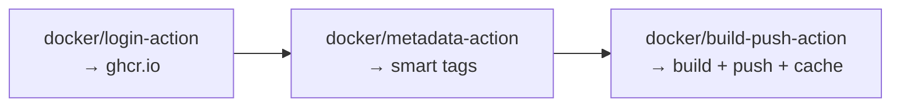

> 🔑 **The permission:** `packages: write` (GHCR is a "package"). `metadata-action` turns a `v1.2.3` tag into `1.2.3`, `1.2`, `1`, `latest` and every push into a `sha-…` tag, so you never hand-write tags. Add `id-token: write` for signed build provenance. The image appears under the repo's **Packages**, pullable with `docker pull ghcr.io/OWNER/REPO:latest`.

> 📋 **Setup:** none beyond the app — [`sample-app/Dockerfile`](sample-app/Dockerfile) ships with the course. Note `context: ./sample-app` in the build step: the context is the **folder holding the Dockerfile**, and every `COPY` inside it is relative to that, not to the repo root.

---

## 39 — Custom JavaScript actions

### ▶️ [`45-javascript-action-demo.yml`](day-04/workflows/45-javascript-action-demo.yml) + [`action.yml`](day-04/actions/greet-js/action.yml) / [`index.js`](day-04/actions/greet-js/index.js)

When you need **real logic** (parse JSON, call an API, control flow) — beyond what a composite action's shell can do — you write a **JavaScript action**. It runs directly on the runner (no container, instant start), on any OS.

```yaml
runs:
  using: 'node20'      # a Node runtime, NOT composite
  main: 'index.js'
```

Under the hood, each `with:` input arrives as an env var `INPUT_<NAME>`, and you set outputs by appending to `$GITHUB_OUTPUT` — exactly like a `run:` step. The official `@actions/core` toolkit wraps both; our demo uses only Node built-ins so there's nothing to install.

> ⚠️ **Production caveat:** a real JS action's dependencies must be **committed** (the runner never runs `npm install`) — teams bundle everything into one file with `@vercel/ncc` and commit `dist/index.js`.

---

## 40 — Custom Docker container actions

### ▶️ [`46-docker-action-demo.yml`](day-04/workflows/46-docker-action-demo.yml) + [`action.yml`](day-04/actions/greet-docker/action.yml) / [`Dockerfile`](day-04/actions/greet-docker/Dockerfile)

When your tool isn't JavaScript or needs specific system packages, a **Docker container action** lets you control the entire environment.

| | JavaScript action | Docker action |
|---|---|---|
| Speed | fast (no image) | slower (builds/pulls first) |
| OS | Linux/Windows/macOS | **Linux only** |
| Environment | whatever Node has | **anything** you put in the image |

```yaml
runs:
  using: 'docker'
  image: 'Dockerfile'          # or docker://ghcr.io/owner/img:tag (prebuilt, faster)
  args: ['${{ inputs.who }}']  # forwarded to the entrypoint
```

Inputs arrive as `INPUT_<NAME>` env vars; outputs go to `$GITHUB_OUTPUT`, which GitHub bind-mounts into the container.

---

## 41 — Publishing & versioning your own action

### ▶️ [`47-publish-custom-action.yml`](day-04/workflows/47-publish-custom-action.yml)

Once an action lives in its own repo, others consume it as `uses: your-org/action@SOMETHING`. The convention everyone follows:

- Cut a real **semver** release for each version: `v1.0.0`, `v1.1.0`, `v2.0.0`.
- **Also** keep a **moving major tag** `v1` that always points at the latest `v1.x`.

```yaml
@v1        → auto non-breaking v1.x updates   (most consumers)
@v1.2.3    → exact, never moves
@<sha>     → maximum security pin             (§30)
```

> 🔑 **The moving-tag trick:** after publishing `v1.4.0`, force-move `v1` to that commit (`git tag -f v1 v1.4.0 && git push --force origin v1`) — the whole maintenance job, automated by the release workflow. Publishing to the **Marketplace** is a manual step: draft a release and tick *"Publish this Action to the Marketplace"* (needs a root `action.yml` with `name`, `description`, `branding`).

---

## 42 — Debugging & running locally with `act`

### ▶️ [`48-debugging-and-act.yml`](day-04/workflows/48-debugging-and-act.yml)

Four tools, cheapest first:

1. **Re-run with debug logging** (a checkbox on "Re-run jobs"), or set repo secrets `ACTIONS_STEP_DEBUG` / `ACTIONS_RUNNER_DEBUG` = `true` for persistent verbose logs.
2. **Print your own** `echo "::debug::msg"` (hidden unless debug is on) and dump contexts with `toJSON(...)`.
3. **SSH into the live runner** with `mxschmitt/action-tmate` (gate it behind a manual input — it's a security risk).
4. **Run locally with [`act`](https://github.com/nektos/act)** — executes workflows in Docker on your machine, skipping the commit-push-wait loop. Not a perfect replica, so always confirm on GitHub.

**What to observe:** the `::debug::` line is hidden on a normal run and appears once debug logging is enabled.

---

## 43 — 🚀 The hardened pipeline (capstone)

### ▶️ [`49-hardened-capstone.yml`](day-04/workflows/49-hardened-capstone.yml)

Every lesson from this day layered onto the earlier pipeline shape:

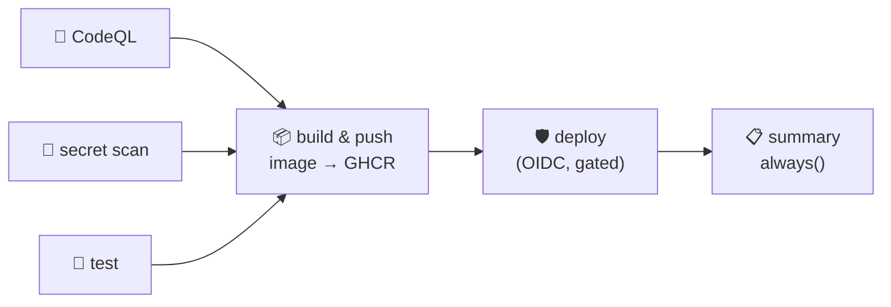

SHA-pinned actions, least-privilege `permissions`, CodeQL + secret-scan gates, a Docker image **built once and pushed to GHCR**, and a `production`-gated deploy that authenticates via **OIDC with no stored cloud key**.

> 🔑 It's the union of the whole course: least privilege (§25), environments/approval (§26), build-once/deploy-same-artifact (§29), SHA pinning (§30), scanning (§31–32), GHCR (§38), and keyless OIDC (§34) — the shape a security-conscious team actually ships.

**📋 Setup:** the `sample-app/` folder (it ships the `Dockerfile` this builds), the `production` environment with a required reviewer, and (for the deploy) an AWS role trusting this repo's OIDC `sub` claim in `vars.AWS_ROLE_ARN`. Remove the OIDC step to run without a cloud account.

---

## 🧾 Cheat sheet

```yaml
name: My Workflow            # display name in the Actions tab

on:                          # WHEN it runs
  push:
    branches: [main]
  pull_request:
  workflow_dispatch:         # manual button
  schedule:
    - cron: '0 2 * * *'      # UTC

env:                         # variables (workflow scope)
  NODE_VERSION: '20'

jobs:                        # WHAT runs (parallel by default)
  build:                     # job id
    runs-on: ubuntu-latest   # the runner
    defaults:
      run:
        working-directory: sample-app   # affects run: steps only
    steps:                   # in order, top to bottom
      - uses: actions/checkout@v5           # reusable action
      - uses: actions/setup-node@v6
        with:                               # inputs to the action
          node-version: ${{ env.NODE_VERSION }}
          cache: 'npm'
          cache-dependency-path: 'sample-app/package-lock.json'
      - run: npm ci                         # shell command
      - run: npm test

  deploy:
    needs: build                            # run only after build succeeds
    if: github.ref == 'refs/heads/main'     # ...and only on main
    runs-on: ubuntu-latest
    steps:
      - run: echo "deploying"

  notify:
    needs: [build, deploy]
    if: always()                            # run whatever happened
    runs-on: ubuntu-latest
    steps:
      - run: echo "build was ${{ needs.build.result }}"
```

| I want to… | Use |
|------------|-----|
| Run on every push | `on: push` |
| Test PRs before merge | `on: pull_request` |
| Add a manual button | `on: workflow_dispatch` |
| Run on a timer | `on: schedule` + `cron` |
| Get my code onto the runner | `uses: actions/checkout@v5` |
| Install Node | `uses: actions/setup-node@v6` |
| Run a shell command | `run:` |
| Pass input to an action | `with:` |
| Store a password/token | Repo secret + `${{ secrets.NAME }}` |
| Store non-secret config | Repo variable + `${{ vars.NAME }}` |
| Read run info | Contexts: `${{ github.* }}`, `${{ runner.* }}` |
| Custom variable (3 scopes) | `env:` at workflow / job / step |
| Make jobs run in order | `needs:` |
| Run a job only on main | `if: github.ref == 'refs/heads/main'` |
| Run cleanup even on failure | `if: always()` |
| Alert only on failure | `if: failure()` |
| Pass a value between jobs | Job `outputs:` + `${{ needs.job.outputs.x }}` |
| Test many versions/OSes | `strategy: { matrix: { node: [20, 22, 24] } }` |
| Keep all matrix rows running | `strategy: { fail-fast: false }` |
| Speed up installs | `cache: 'npm'` on setup-node, or `actions/cache@v6` |
| Share a file between jobs | `upload-artifact@v7` → `download-artifact@v8` |
| Reuse a whole job | `uses: ./.github/workflows/x.yml` (job level) |
| Reuse a few steps | Composite action + `uses: ./.github/actions/x` |
| Lock down the token | `permissions: { contents: read }` |
| Require approval before deploy | `environment: production` (with a required reviewer) |
| Cancel stale runs | `concurrency:` + `cancel-in-progress: true` |
| Cap a job's runtime | `timeout-minutes: 10` |
| Let an optional step fail | `continue-on-error: true` (check `.outcome`) |
| Pin an action safely | `uses: owner/action@<full-sha>  # v1.2.3` |
| Scan code for vulns | `github/codeql-action/init` + `analyze` (`security-events: write`) |
| Deploy without stored keys | `permissions: { id-token: write }` + cloud login action (OIDC) |
| Publish an image to GHCR | `docker/login-action` + `build-push-action` (`packages: write`) |
| Reuse real logic | JS action (`using: node20`) or Docker action (`using: docker`) |
| Version your action | semver tag `v1.2.3` + moving major tag `v1` |
| Trigger from outside GitHub | `on: repository_dispatch` (API `POST /dispatches`) |

---

## 🔗 Reference links

**Official documentation**

- [GitHub Actions documentation (home)](https://docs.github.com/en/actions)
- [Quickstart for GitHub Actions](https://docs.github.com/en/actions/quickstart)
- [Understanding GitHub Actions (core concepts)](https://docs.github.com/en/actions/learn-github-actions/understanding-github-actions)
- [Workflow syntax reference](https://docs.github.com/en/actions/using-workflows/workflow-syntax-for-github-actions)
- [Events that trigger workflows](https://docs.github.com/en/actions/reference/events-that-trigger-workflows)
- [Contexts](https://docs.github.com/en/actions/learn-github-actions/contexts) · [Expressions](https://docs.github.com/en/actions/learn-github-actions/expressions)
- [Using secrets](https://docs.github.com/en/actions/security-guides/using-secrets-in-github-actions) · [Variables](https://docs.github.com/en/actions/learn-github-actions/variables)
- [Using jobs — `needs`, `if`, outputs](https://docs.github.com/en/actions/using-jobs/using-jobs-in-a-workflow)

**Hands-on / learning**

- [GitHub Skills: interactive Actions courses](https://skills.github.com/)
- [Awesome Actions (curated list)](https://github.com/sdras/awesome-actions)

**Tools**

- [crontab.guru — build cron expressions](https://crontab.guru)
- [YAML Lint — validate your YAML](http://www.yamllint.com/)
- [GitHub Actions VS Code extension](https://marketplace.visualstudio.com/items?itemName=github.vscode-github-actions)

---

## 🎓 You've finished the course

From *"I've never written a line of YAML"* to a **hardened, gated, keyless CI/CD pipeline** — that's the whole journey:

- **Foundations** — YAML, workflow anatomy, triggers, runners, `run`/`uses`, Marketplace actions
- **The workflow language** — variables, contexts, secrets, and your first full CI pipeline
- **Real pipelines** — `needs`, `if`, matrix, caching, artifacts, reusable workflows, composite actions, permissions, environments, concurrency
- **Advanced** — SHA pinning, CodeQL & secret scanning, OIDC keyless cloud auth, custom JavaScript/Docker actions, GHCR, and publishing your own action

**Where to go from here:** build the [`49-hardened-capstone.yml`](day-04/workflows/49-hardened-capstone.yml) against your own project, wire OIDC to your real cloud account, publish an action you actually use, and turn on branch protection so every merge runs through the pipeline. The master blueprint is in [`COURSE_OUTLINE.md`](COURSE_OUTLINE.md).

Thanks for building along. If the series helped you, a like and subscribe on **LearnWithMithran** means a lot. 🚀
